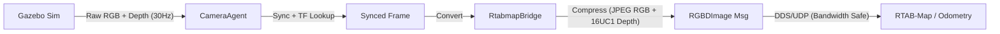

# steve_perception

`steve_perception` is a ROS 2 package that standardizes **RGB-D inputs** for SLAM.

It provides:
- **CameraAgent** nodes that time-synchronize `Image` + `Depth` + `CameraInfo` and publish `rtabmap_msgs/RGBDImage`.
- Launch files for:
  - **Perception only** (publishes `/steve_perception/<camera>/rgbd_image`).
  - **Mapping** with RTAB-Map (`rgbdx_sync` -> `rgbd_odometry` -> `rtabmap` -> `rtabmap_viz`).




## Prerequisites

- Ubuntu + ROS 2 (tested with **Humble**)
- `rtabmap_ros` installed (binary is fine for single camera)

Install dependencies:

```bash
sudo apt update
sudo apt install -y \
  ros-humble-rtabmap-ros \
  ros-humble-rtabmap-msgs \
  ros-humble-tf2-ros \
  ros-humble-tf-transformations \
  ros-humble-message-filters \
  ros-humble-cv-bridge
```

## Build

Add the package to a ROS 2 workspace and build with `colcon`:

```bash
mkdir -p ~/ros2_ws/src
cd ~/ros2_ws/src
# put this repository/package here

cd ~/ros2_ws
rosdep install --from-paths src -i -y
colcon build --symlink-install
source install/setup.bash
```

## Configuration

- `config/steve.yaml`
  - Defines cameras and their raw topic names
  - Controls which cameras are allowed to publish `RGBDImage`

- `config/mapping.yaml`
  - Mapping profile (frames, `use_sim_time`, and which RGBD topics to use)

- `config/rtabmap_*.ini`
  - RTAB-Map algorithm parameters

## Quick checks

```bash
# Is RGBDImage being published?
ros2 topic hz /steve_perception/front/rgbd_image

# Do all nodes use simulation time (Gazebo)?
ros2 param get /rtabmap use_sim_time

# TF sanity (should not spam extrapolation errors)
ros2 run tf2_tools view_frames
```

### Bandwidth Optimization
In ROS 2, sending large raw point clouds or float images (>2MB) over UDP can cause massive packet drops (effective rate <1Hz).
- **Solution**: We compress RGB to JPEG and convert Float32 Depth (Meters) to **Uint16 (Millimeters)**.
- **Result**: size reduces to ~0.6MB, enabling stable ~7Hz transmission.
- **Note**: The system strictly follows **ROS REP 118** (16UC1 = mm, 32FC1 = m) to avoid scaling errors with infinite depth (sky).

## Usage

### 1) Mapping with Pan-Tilt Camera (Recommended)
This launches the full stack: Controller + Perception + RTAB-Map + Viz.

```bash
ros2 launch steve_perception mapping_pan_tilt.launch.py pan_tilt_sweep:=true
```

- **`pan_tilt_sweep:=true`**: Makes the camera look around (elliptical trajectory) to build a better map.

### 2) Pan-Tilt Control Tool
You can manually control the camera using the CLI tool:

```bash
ros2 run steve_perception pan_tilt_control --pan 30 --tilt -10 --speed 20
```

**Arguments:**
- `--pan <deg>`: Target pan angle.
- `--tilt <deg>`: Target tilt angle.
- `--speed <deg/s>`: Movement speed.
- `--sweep`: Start continuous elliptical sweeping.
- `--log`: Enable feedback logging to terminal.

## Troubleshooting

### "No Point Cloud" / "All Zeros"
- **Symptom**: Cloud is empty, or logs say `Depth conversion result is ALL ZEROS`.
- **Cause**: Usually incorrect unit conversion. If `inf` (sky) values are present, naive scaling logic can fail.
- **Fix**: The current `CameraAgent` logic enforces strict type checking. Ensure Gazebo cameras are outputting standard `32FC1` (meters).

### "Maps update=0.0000s" (RTAB-Map)
- **Cause**: RTAB-Map waits for the robot base to move before adding new nodes (to save memory).
- **Fix**: Move the robot! Or set `Rtabmap/LinearUpdate` to 0 in `config/rtabmap_rgbd.ini` to force updates (debug only).

## Common failures (and what they actually mean)

- **RTAB-Map: "Did not receive data since 5 seconds"**
  - One of the synced inputs paused, has no header stamp, or timestamps drift too far.
  - Check rates:
    - `ros2 topic hz /steve_perception/front/rgbd_image`
    - (and the underlying raw RGB/depth topics)
  - If rates are noisy, increase `topic_queue_size` / `sync_queue_size` in the launch.

- **TF: "Lookup would require extrapolation into the future"**
  - The sensor message timestamp is *ahead* of the newest TF available.
  - Usual causes:
    - `use_sim_time` mismatch between nodes
    - TF published with the wrong clock (sim vs wall)
    - TF published too slowly for your sensor timestamps
  - Mitigations:
    - Make `use_sim_time` consistent across the stack.
    - Increase `wait_for_transform` and/or `tf_delay` slightly (RTAB-Map params).

## Run with Docker

To run the segmentation pipeline using the official Docker image:

```bash
docker run --rm --gpus all \
  -v $(pwd):/workspace \
  -w /workspace \
  -e PYTHONPATH="/workspace/source" \
  steve_perception:unified \
  python3 source/scripts/run_segmentation.py \
  --data data/pipeline_output \
  --model openyolo3d \
  --vocab furniture
```

**Arguments:**
*   `--data`: Path to data directory. Must contain an `export/` folder (from `export_data.py`).
*   `--model`: Model to use (`openyolo3d` or `mask3d`).
*   `--vocab`: Vocabulary mode: `furniture` (default), `lvis`, `coco`, or `custom`.

**Outputs:**
*   All outputs are saved to the `--data` directory:
    *   `<data>/<model>_output/`: Segmentation results (masks, objects).
    *   `<data>/logs/`: Full execution logs.

---

## Scene Graph Pipeline

> **Attribution:** The scene graph pipeline is adapted from [stretch-compose](https://github.com/hrl-labs/stretch-compose) by HRL Laboratories. See `source/README.md` for details.

The pipeline generates semantic scene graphs from RTAB-Map data:

```
RTAB-Map DB → exporter.py → Mask3D → generator.py → Scene Graph JSON
```

### Quick Start

The pipeline is fully automated. Run from the package root:

```bash
# 1. Run the full pipeline (Export -> Inference -> Generation)
python3 source/scripts/run_scene_graph_pipeline.py data/rtabmap.db

# 2. Visualize the results
# Point Cloud:
python3 source/scripts/visualize_mask3d.py data/scene_graph_output

# Texture Mesh with Labels (Best for verification):
python3 source/scripts/visualize_mesh_labels.py data/scene_graph_output

# Verify Connectivity/Topology (Nodes + Edges):
python3 source/scripts/visualize_graph_connections.py data/scene_graph_output/scene_graph --mesh data/scene_graph_output/mesh.ply
```

**Output:** 
- `data/scene_graph_output/scene_graph/graph.json`: The semantic graph.
- `data/scene_graph_output/segmented_mesh.ply`: Verifiable mesh.

### Verification
To verify the output:
1. Open `segmented_mesh.ply` in **MeshLab** or **CloudCompare**.
2. Check if the colors match the object classes (e.g., floors, walls, chairs should be distinct).
3. The `graph.json` should contain nodes for these objects.

*(Add screenshots of your segmented mesh here)*


