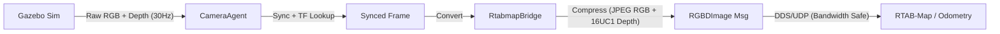

# Technical Documentation

Detailed information for developers and advanced users.

## ROS 2 Architecture

**steve_perception** standardizes RGB-D inputs for SLAM using time-synchronized nodes.

## Bandwidth Optimization
Sending raw point clouds over UDP causes packet drops.
- **Problem**: Large messages (>2MB) @ 30Hz saturate bandwidth.
- **Solution**: 
  - RGB → JPEG Compression
  - Depth (Float32 m) → Uint16 (mm)
  - **Result**: ~0.6MB per frame, stable 7Hz transmission.

## Configuration Files

- `config/steve.yaml`
  - Defines cameras and topic names.
  - Controls which cameras publish `RGBDImage`.

- `config/mapping.yaml`
  - Mapping profile (frames, `use_sim_time`, topic selection).

- `config/rtabmap_*.ini`
  - Internal RTAB-Map algorithm parameters.

## Troubleshooting

### "No Point Cloud" / "All Zeros"
- **Cause**: Incorrect unit conversion or `inf` values in depth.
- **Fix**: Check Gazebo camera output format (should be `32FC1`).

### "Maps update=0.0000s"
- **Cause**: RTAB-Map waiting for robot movement.
- **Fix**: Move the robot or set `Rtabmap/LinearUpdate` to 0.

### Database Location
Default database is saved to `data/rtabmap.db` within the package directory (relative to the launch file).

### TF Extrapolation Errors
- **Cause**: Timestamp mismatch between sensor and TF.
- **Fix**: Ensure consistent `use_sim_time` across all nodes.

## Data Pipeline & Coordinate Systems

### 1. Coordinate Standardization (Export Step)
The pipeline relies on **OpenGL Coordinate Convention** (X Right, Y Up, Z Backward), whereas RTAB-Map uses the ROS Standard (Optical) Frame (X Right, Y Down, Z Forward).
- **Transformation**: `source/scripts/export_data.py` applies a correction matrix `diag(1, -1, -1, 1)` to all Camera Poses ($T_{world \to cam}$).
- **Effect**:
  - **X**: Unchanged (Right is Right).
  - **Y**: Flipped (Down $\to$ Up).
  - **Z**: Flipped (Forward $\to$ Backward).
  - **Rotation**: Determinant remains $+1$ (Valid Rotation), preventing "Mirror World" artifacts.

### 2. Model Data Usage
- **Mask3D**: Operates directly on `scene.ply`. Since this point cloud is in the World Frame (and we only transformed the Camera Poses), Mask3D 3D segmentation is unaffected by the axis flip and works on the original geometry.
- **YOLO-Drawer**: Uses the Transformed Poses (`poses/*.txt`) to project 2D detections into the 3D World (matching `scene.ply`). Correct alignment ensures the projection rays intersect the point cloud.

### 3. "No 3D Box Found" & Point Density
The system enforces a safety threshold to avoid generating garbage 3D boxes from noise.
- **Threshold**: Requires at least **15 points** inside the frustum.
- **Voxel Downsampling**: If export is run with `--voxel_size 0.05` (5cm), small objects or distant surfaces may have fewer than 15 points.
- **Fix**: To capture smaller items, re-export with `--voxel_size 0.02` (2cm), though this increases memory usage.

### 4. Bounding Box Orientation
For sparse or flat objects (like cabinet doors), the **PCA-based Orientation** (Principal Component Analysis) can be unstable or non-intuitive. The system calculates the "Minimal Oriented Bounding Box", which minimizes volume but doesn't guarantee axis alignment with the floor unless constrained.

### 5. Export Configuration & Multi-Resolution
The export process is controlled by `source/configs/rtabmap_export.yaml`.
- **Primary Voxel Size**: Determines the resolution of `export/scene.ply`.
  - **Significance**: This is the **Active File** that YOLO and Mask3D will use.
  - Setting this to `0.02` automatically upgrades the entire downstream pipeline to high-resolution.
- **Multi-Resolution**: If enabled, creates `export/clouds_multires/` with files like `scene_v0.005.ply`, `scene_v0.010.ply`, etc.
  - **Use Case**: These are for analysis or benchmarking. To use one, rename it to `scene.ply`.
