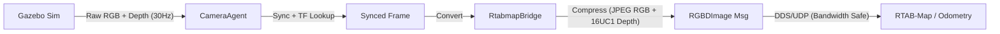

# Technical Documentation

Detailed information for developers and advanced users.

## ROS 2 Architecture

**steve_perception** standardizes RGB-D inputs for SLAM using time-synchronized nodes.

## Bandwidth Optimization
Sending raw point clouds over UDP causes packet drops.
- **Problem**: Large messages (>2MB) @ 30Hz saturate bandwidth.
- **Solution**: 
  - RGB → JPEG Compression
  - Depth (Float32 m) → Uint16 (mm)
  - **Result**: ~0.6MB per frame, stable 7Hz transmission.

## Configuration Files

- `config/steve.yaml`
  - Defines cameras and topic names.
  - Controls which cameras publish `RGBDImage`.

- `config/mapping.yaml`
  - Mapping profile (frames, `use_sim_time`, topic selection).

- `config/rtabmap_*.ini`
  - Internal RTAB-Map algorithm parameters.

## Troubleshooting

### "No Point Cloud" / "All Zeros"
- **Cause**: Incorrect unit conversion or `inf` values in depth.
- **Fix**: Check Gazebo camera output format (should be `32FC1`).

### "Maps update=0.0000s"
- **Cause**: RTAB-Map waiting for robot movement.
- **Fix**: Move the robot or set `Rtabmap/LinearUpdate` to 0.

### TF Extrapolation Errors
- **Cause**: Timestamp mismatch between sensor and TF.
- **Fix**: Ensure consistent `use_sim_time` across all nodes.
